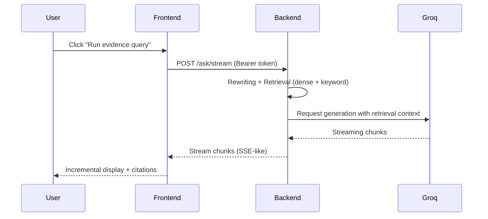

# TrialSight Intelligence

Clinical Trial Evidence Assistant — a product-focused RAG system for secure, citation-grounded interrogation of clinical trial PDFs.

Live demo
- Frontend (Vercel): https://trial-sight-intelligence.vercel.app/login?v=3

Summary
-------
TrialSight is designed for focused document interrogation, not generic brainstorming. It combines a static frontend, a Dockerized FastAPI backend, hybrid retrieval (dense + keyword), and Groq LLM inference to produce evidence-backed answers with source citations while enforcing strict rate limits and per-user isolation.

Highlights
- Upload PDFs and ingest into a chunked, source-traceable index
- Hybrid retrieval: dense vectors + BM25 + reranking
- Streaming, citation-aware answers (SSE/streaming API)
- JWT-based auth and per-user data isolation
- Cost controls and rate limiting (Redis optional)
- Simple deploy path: Render (backend) + Vercel (frontend)

Architecture (high level)
-------------------------

Mermaid component diagram

```mermaid
graph LR
  U["User Browser (Vercel Frontend)"] -->|HTTP(S)| CDN["Vercel CDN"]
  CDN --> F["Static Frontend Files"]
  F -->|HTTPS: /auth, /upload, /ask| B["Render Backend (FastAPI)"]
  B --> DB["SQLite on persistent disk"]
  B --> RD["Redis (optional) - rate limiting"]
  B --> LLM["Groq LLM API"]
  B -->|stores| Index["Document Index (vectors + metadata)"]
  subgraph Cloud
    LLM
    RD
  end
```

Sequence: ask -> retrieve -> answer



Component responsibilities
--------------------------
- Frontend (frontend/)
  - Static UI (login, upload, chat). Minimal JS; streaming client to render SSE-style responses.
  - `frontend/config.js` controls `apiBase` (backend URL). When deploying, set this to your Render URL.
- Backend (backend/)
  - FastAPI app that handles auth, upload, ingestion, retrieval, and streaming completion endpoints.
  - `render.yaml` contains the recommended Render configuration (docker, disk, health check).
  - CORS controlled via `FRONTEND_ORIGINS` environment variable.
- Index & Retrieval
  - Documents are chunked and embedded into a lightweight vector store + BM25 index.
  - Retrieval pipeline: dense search -> BM25 -> rerank -> final top-K passed to LLM.
- LLM
  - Groq is used by default (configurable via `GROQ_MODEL` and `GROQ_API_KEY`).
- Rate limiting
  - Redis-backed token buckets when `REDIS_URL` provided; otherwise an in-memory fallback.

API quick reference
-------------------
- `POST /auth/signup` — create analyst account. Body: `{ "email": "x", "password": "y" }`
- `POST /auth/login` — returns `{ access_token }`
- `GET /auth/me` — returns user info (requires bearer)
- `POST /upload` — multipart upload `files` (PDFs)
- `POST /ask/stream` — streaming answer endpoint (SSE-style, requires bearer)

Example: signup + ask flow (curl)

```bash
# signup
curl -sS -X POST https://trialsight-intelligence.onrender.com/auth/signup \
  -H "Content-Type: application/json" \
  -d '{"email":"you@example.com","password":"password123"}'

# login -> save token
TOKEN=$(curl -sS -X POST https://trialsight-intelligence.onrender.com/auth/login \
  -H "Content-Type: application/json" \
  -d '{"email":"you@example.com","password":"password123"}' | jq -r .access_token)

# ask (simplified non-streaming example)
curl -sS -X POST https://trialsight-intelligence.onrender.com/ask \
  -H "Authorization: Bearer $TOKEN" \
  -H "Content-Type: application/json" \
  -d '{"question":"What was the primary endpoint?"}'
```

Deployment (concise)
--------------------

Backend (Render)
1. Deploy via the `render.yaml` blueprint (one-click) or create a Web Service (Docker).
2. Ensure environment variables are set:
   - `GROQ_API_KEY` — required for LLM
   - `FRONTEND_ORIGINS` — include your Vercel URL(s), e.g. `https://trial-sight-intelligence.vercel.app`
   - `APP_ENV=production`
3. Add a 1GB disk at `/app/data` and enable health checks at `/health`.

Frontend (Vercel)
1. Import repo on Vercel and set **Root Directory** to `frontend`.
2. Use `Other` framework preset (static). No build command needed — static files are committed.
3. After deploying, update `frontend/config.js` `apiBase` to point at your Render backend, or set it using an environment file step before deploy.

Keeping the backend warm
-----------------------
- Render free tier may spin down inactive services. Options to keep always-on:
  - Upgrade to a paid Render plan (recommended for production)
  - Create a Render Cron Job or external uptime monitor to ping `/health` every 5 minutes

Operations & Troubleshooting
----------------------------
- CORS issues: ensure `FRONTEND_ORIGINS` includes the exact Vercel origin (match hostname).
- Failed to fetch in browser: check DevTools Network tab; confirm `config.js` served by Vercel and `apiBase` is correct.
- Rate-limited responses: check `X-RateLimit-*` headers and `REDIS_URL` settings.

Repository layout
-----------------
```text
backend/
  Dockerfile
  main.py
  app/
    api/
    core/
    models/
    rag/
    rate_limit/
    services/
frontend/
  login.html
  chat.html
  styles.css
  config.js
vercel.json  # top-level rewrite (optional)
render.yaml  # Render service blueprint
```

Contributing
------------
- Bug reports & PRs welcome. Follow these steps:
  1. Fork repository
  2. Create a feature branch
  3. Include tests for non-trivial logic
  4. Open PR describing your change

Security & privacy notes
------------------------
- This project is for demonstration and research. DO NOT deploy with default `JWT_SECRET` in production.
- Uploaded PDFs are stored on the Render disk — treat them as sensitive data.

Contact / Credits
-----------------
Built with FastAPI, Docker, and Groq LLMs. If you need help with deployment or an architecture walkthrough, open an issue or ping the maintainer.

---

Deep dive: retrieval & LLM orchestration
---------------------------------------

This project intentionally blends multiple IR (information retrieval) and LLM engineering patterns to produce accurate, source-cited answers while controlling cost and abuse. Key concepts and components you will find in the codebase or that the system is designed to support:

- Chunking & tokenization: documents are split into overlapping passages (sliding window) to preserve local context and page-level citations.
- Embeddings & dense vectors: passages are embedded into vector space for semantic search (compatible with SentenceTransformers-style embeddings).
- BM25 (lexical retrieval): a fast, robust lexical candidate generator used in parallel with dense retrieval to capture exact-match signals.
- Hybrid retrieval (lexical + semantic): the system merges BM25 candidates with dense nearest-neighbors for high recall.
- ANN indices (HNSW/FAISS-compatible): the architecture supports approximate nearest neighbor indices for fast, scalable vector search.
- Reranking / cross-encoder: a lightweight reranker reorders candidates using a context-aware cross-encoder to optimize precision@k before generation.
- Late fusion / score fusion: lexical and semantic scores are combined using tunable weights to produce final candidates.
- Citation metadata: every passage stores source metadata (filename, page, offset) so answers map back to exact evidence.
- Prompt engineering & templates: retrieval context is inserted into a system prompt that instructs the LLM to ground answers and include inline citations.
- Streaming & chunked generation: the backend streams tokens to the frontend (SSE-style) so the UI displays answers as they arrive and updates citations when meta messages appear.
- Token budget & cost controls: the orchestration layer caps context size, truncates lower-quality passages, and enforces generation token limits per-request.
- Rate limiting, circuit breakers, and concurrency limits: protects the LLM provider spend and enforces per-user/demo global quotas (Redis-backed when available).

Evaluation & metrics
--------------------

- Offline metrics: precision@k, recall@k, MRR, and nDCG are supported concepts for evaluating retrieval quality.
- Human evaluation: the `services/evaluation.py` scaffolds manual grading of responses (quality, citation accuracy, hallucination rate).
- Production metrics: latency (p50/p95), request error rate, and LLM token consumption are primary operational metrics to track.

DevOps, observability, and CI/CD
--------------------------------

- Containerized: backend runs in Docker (Render uses the Dockerfile in `backend/`).
- CI/CD: repository is CI-friendly (use GitHub Actions to lint, run unit tests, and optionally deploy).
- Monitoring: designed to emit structured logs and metrics (compatible with OpenTelemetry / Prometheus + Grafana). Add Sentry for error tracking.
- Health checks: `/health` returns service status and is used by Render for uptime checks.

Security & privacy (expanded)
-----------------------------

- Authentication: JWT tokens secure API endpoints; rotate `JWT_SECRET` in production.
- Transport security: always use HTTPS in production (Vercel and Render provide TLS by default).
- CSP & headers: `X-Frame-Options`, `X-Content-Type-Options`, and `Referrer-Policy` headers are set via `vercel.json` and `render.yaml` headers.
- Data retention: uploaded PDFs live on the Render persistent disk by default — purge or encrypt if storing sensitive PHI.

Buzzwords & technologies mentioned
----------------------------------

BM25, TF–IDF, tokenization, SentenceTransformers, embeddings, dense retrieval, FAISS, HNSW, approximate nearest neighbor (ANN), cosine similarity, cross-encoder reranking, late fusion, hybrid search, chunking, sliding window, passage-level citation, prompt templates, system prompt, instruction tuning, streaming SSE, server-sent events, JWT, Redis, rate limiting, token bucket, circuit breaker, backpressure, token budgeting, vector quantization, index sharding, batched embeddings, batching, concurrency limits, OpenTelemetry, Prometheus, Grafana, Sentry, GitHub Actions, Docker, Render, Vercel, Groq, nDCG, precision@k, recall@k, MRR.

Want images instead of Mermaid?
--------------------------------
If you prefer PNG/SVG images for the diagrams (useful for README rendering on platforms without Mermaid support), I can render the Mermaid diagrams to SVG/PNG and add them to `docs/` and reference them in this README.

---
_This README was updated to include the live frontend and backend URLs, architecture diagrams, an expanded developer guide, and a deep dive with retrieval/LLM buzzwords._
